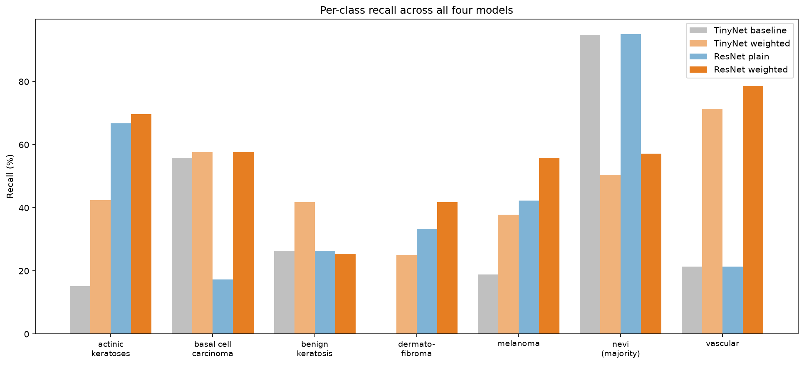
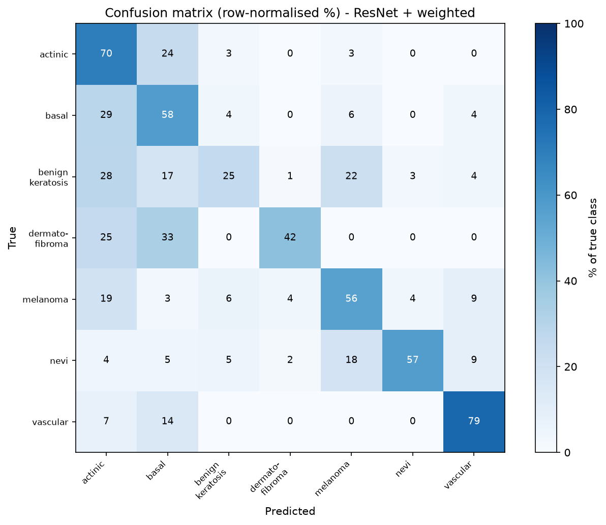
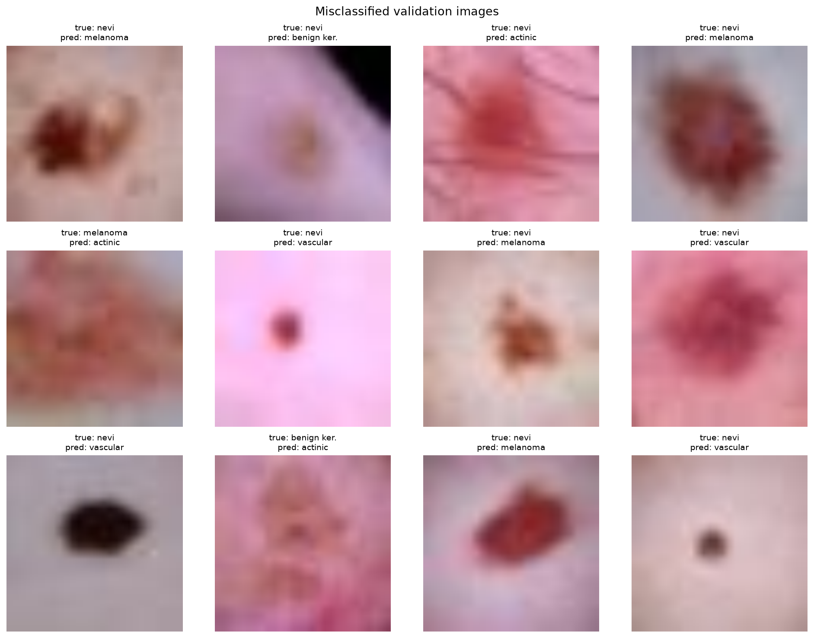

# SkinSight

A deep-learning image classifier for skin-lesion diagnosis, built in PyTorch on the DermaMNIST (HAM10000) dataset. The project trains models to classify dermatoscopic images into 7 lesion types, with a focus on the central challenge of the dataset: severe class imbalance, where the naive "high accuracy" is dangerously misleading.



## The problem

DermaMNIST contains 7 classes of skin lesion, but they are wildly imbalanced: melanocytic nevi make up 67% of the data, while dermatofibroma is just 1.1%. This creates a trap: a model that ignores the images and always predicts the majority class scores 67% accuracy while learning nothing useful.

This matters clinically, not just statistically. The rare classes include melanoma, the most dangerous lesion. A model that plays the odds by ignoring rare classes will systematically miss the cases that matter most. So the real goal is not headline accuracy, but per-class recall, especially on the dangerous minority classes.

## Approach

I ran a controlled 2x2 experiment, varying two factors independently:

- **Architecture:** a small from-scratchfully-connected network (`TinyNet`) vs a pretrained ResNet-18 (transfer learning, frozen body + fine-tuned head).
- **Loss:** standard cross-entropy vs inverse-frequency **weighted** cross-entropy (making rare-class errors cost more).

This isolates the effect of each factor and tests whether better features (transfer learning) and imbalance handling (weighting) are the same thing or separate, complementary tools.

## Results

Per-class recall (%), validation set:

| Class | TinyNet | TinyNet + weighted | ResNet | ResNet + weighted |
|---|---|---|---|---|
| actinic keratoses | 15.2 | 42.4 | 66.7 | 69.7 |
| basal cell carcinoma | 55.8 | 57.7 | 17.3 | 57.7 |
| benign keratosis | 26.4 | 41.8 | 26.4 | 25.5 |
| dermatofibroma | 0.0 | 25.0 | 33.3 | 41.7 |
| **melanoma** | 18.9 | 37.8 | 42.3 | **55.9** |
| nevi (majority) | 94.6 | 50.4 | 95.1 | 57.1 |
| vascular | 21.4 | 71.4 | 21.4 | 78.6 |
| **overall accuracy** | 72.0 | 48.2 | 75.0 | 54.0 |

**Key findings:**

1. **Accuracy is misleading here.** The plain TinyNet's 72% comes almost entirely from the majority class (94.6% recall on nevi) while it misses 81% of melanomas. High accuracy, poor screening tool.

2. **Feature quality and imbalance handling are separate problems.** Transfer learning raised overall accuracy and melanoma recall, but the plain ResNet still leaned on the majority class (95.1% nevi). Better features alone did not solve imbalance.

3. **The two techniques stack.** ResNet + weighted loss catches the most melanomas of any configuration (55.9% vs a baseline of 18.9%) while staying balanced across rare classes. Its overall accuracy is lower, but it is the most useful model for screening, where a missed melanoma is far costlier than a false alarm.

### Evaluation

Beyond recall, the best model was evaluated with a confusion matrix and full precision/recall/F1 analysis:



The model trades precision for recall on dangerous classes: it catches 56% of melanomas but with many false alarms (29% precision). The confusion matrix shows its errors are mostly "safe" ones, confusing melanoma with other malignant classes rather than benign ones, and over-flagging benign moles as suspicious. For a screening context, erring toward caution is the defensible bias.



A macro-average F1 of 0.376 (vs a weighted-average of 0.596) quantifies the remaining gap: the model is still stronger on common classes than rare ones.

## What I would improve

- **Data augmentation / oversampling** for the rare classes, to reduce false alarms without losing recall.
- **Unfreezing ResNet** to fine-tune its features to the skin-lesion domain (requires a GPU; the frozen body keeps its generic ImageNet features).
- **Higher input resolution.** Images are upscaled from 28x28, so fine texture, a real diagnostic cue, is lost. Training on the native higher-resolution HAM10000 images would likely help.
- **Tuning the weighting strength** to better balance the precision/recall trade rather than over-flagging.

## Repository structure

```
SkinSight/
├── notebooks/          # step-by-step build, from PyTorch fundamentals to evaluation
│   ├── 00_tensors.ipynb ... 02_training_loop.ipynb   # fundamentals (built from scratch)
│   ├── 03_data.ipynb                                 # data loading + imbalance analysis
│   ├── 04_baseline_and_imbalance.ipynb               # weighted-loss experiment
│   ├── 05_transfer_learning.ipynb                    # ResNet transfer learning
│   └── 06_evaluation.ipynb                           # confusion matrix, F1, failure gallery
├── src/                # reusable, importable pipeline
│   ├── model.py        # TinyNet + ResNet builder
│   ├── data.py         # transforms, loaders, class weights
│   └── train.py        # train / evaluate / seed functions
└── requirements.txt
```

## Running it

```bash
pip install -r requirements.txt
```

The full pipeline runs in a few lines via the `src/` module:

```python
from src.model import build_resnet
from src.data import get_loaders, compute_class_weights
from src.train import set_seed, train, evaluate

set_seed(42)
train_loader, val_loader, train_data = get_loaders()
weights = compute_class_weights(train_data)

model = build_resnet(num_classes=7, freeze_body=True)
model = train(model, train_loader, class_weights=weights, epochs=3)
accuracy, per_class_recall = evaluate(model, val_loader)
```

Or work through the notebooks in order to see the full build, from tensor basics to the final evaluation.

## Tech stack

PyTorch, torchvision, scikit-learn, medmnist, matplotlib, NumPy.

## Note

This is an educational project on a public benchmark dataset. It is not a medical device and must not be used for actual diagnosis.

## License

This project is licensed under the MIT License - see the [LICENSE](LICENSE) file for details.

The DermaMNIST dataset is distributed under CC BY-NC 4.0 (non-commercial). The underlying HAM10000 images are credited to their original authors.